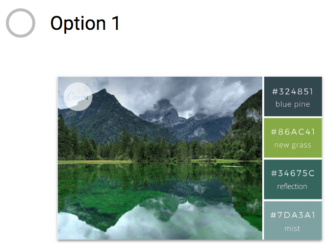
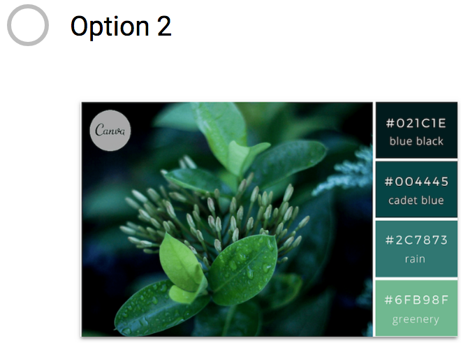
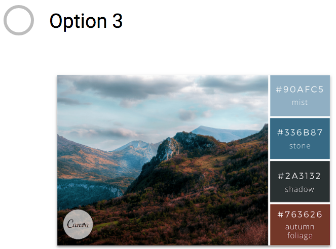
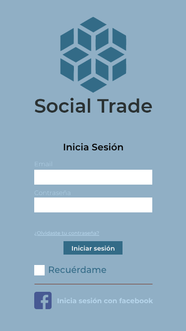
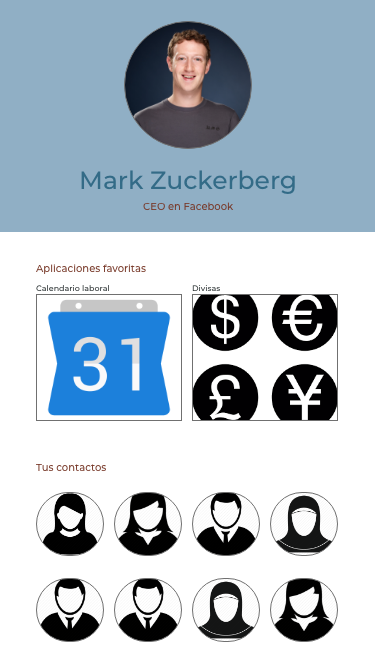

# Social Trade
## Red Social para comercio 

Se define como comercio internacional, comercio exterior o comercio mundial al movimiento que tienen los bienes y servicios a través de los distintos países y sus mercados. 

## Problemática
Al ser una actividad que se puede realizar entre distintos países, la problemática es muy extensa.

Se realizaron encuestas con personas que se dedican al comercio para saber cuáles son los principales problemas a los que se enfrentaban.  

Los principales problemas que encontramos son: barreras de comunicación, usos horarios, tipos de cambio y días festivos. 

Las paletas de color a elegir fueron las siguientes: 

Ya que hubo un empate entre la opción 1 y la 3, optamos por la opción 3. 

## Solución al problema
Al crear una red social, será mas fácil para el usuario compartir datos específicos con sus clientes y/o proveedores; donde se tenga a la vista un calendario laboral de los distintos países con los que se tiene contacto, el tipo de cambio de la moneda con la que se trabaja, y la agenda de contactos con la opción de guardar en favoritos. También se puede ver lo que otros contactos o empresas comparten, para estar al tanto de las novedades. 

### Vista de inicio de sesión

### Vista del perfil de otra persona con su tarjeta de contacto y el timeline

### Vista del propio perfil con las aplicaciones favoritas y contactos favoritos

## Resultado final
[Social Trade](https://belenha.github.io/social-trade/. "Title")
